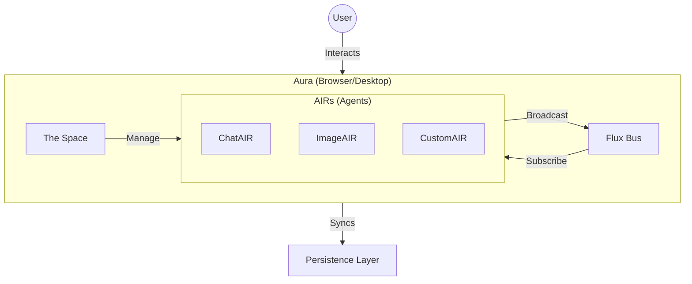

# 🌌 Aura

**A spatial, agentic window manager for the AI age.**

Aura rethinks the traditional desktop interface by replacing static windows with **AIRs** (Agentic Interface Respondents) that live in a shared, reactive environment called **The Space**.

## Architecture

## Documentation

For full documentation, architecture details, and developer guides, please visit the **[Project Wiki](https://github.com/bahadiri/Aura/wiki)**.
