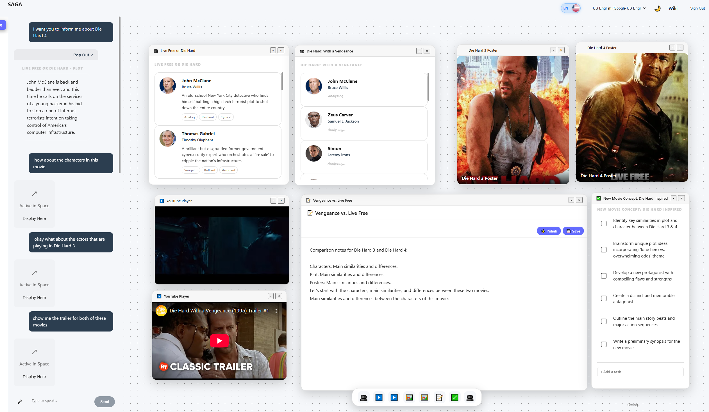

# 🌌 Aura

**A UX for the Gen AI age based on UI Retrieval Philosophy.**

For real enriched experiences, just chatting is not enough. We should be able to talk, see visuals, and interact with the UI. While "generative UI" promises this, it often falls short in practice.

Aura alternatively provides the **UI Retrieval Philosophy**: instead of generating fragile interfaces on the fly, it intelligently retrieves and composes highly-polished, interactive **AIRs** (Agentic Interface Respondents) into a shared, reactive environment called **The Space**.

## Documentation

For full documentation, architecture details, and developer guides, please visit the **[Project Wiki](https://github.com/bahadiri/Aura/wiki)**.
