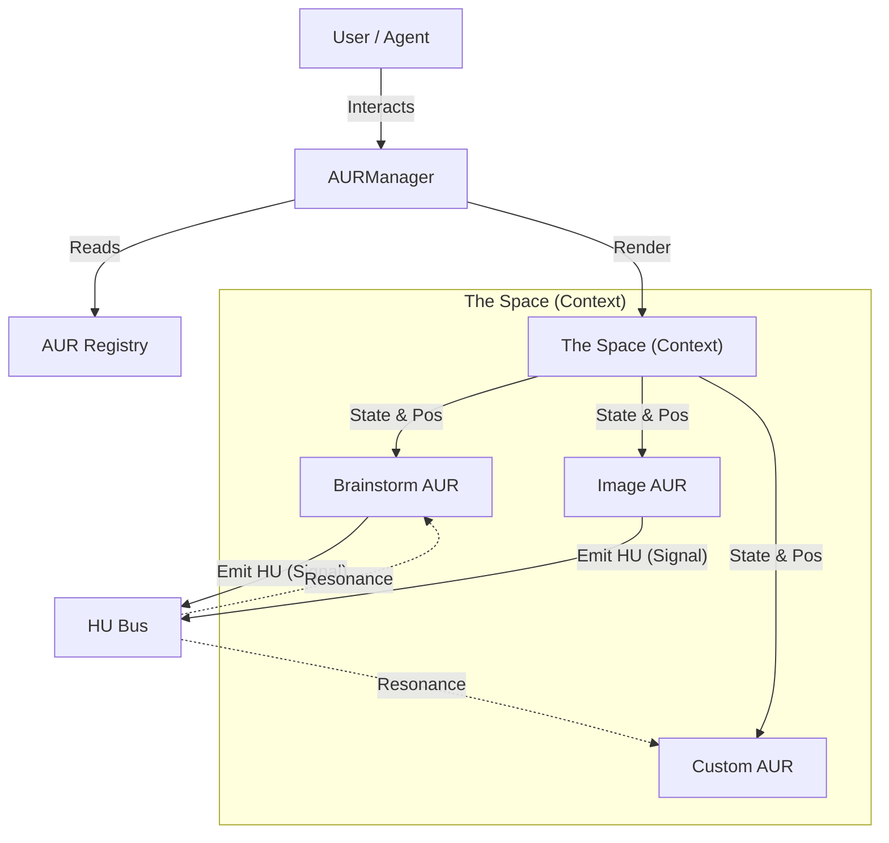

# 🏗️ Aura Architecture

This document details the technical architecture of the Aura system, focusing on the interactions between the Registry, the Context ("The Space"), and the individual AURs.

## System Diagram



## The New AUR Standard (`AURManifest`)

Every valid component in the Aura system must adhere to the `AURManifest` interface. This ensures that the system can validate, manage, and "understand" the capabilities of every window.

```typescript
export interface AURManifest {
    id: string; // Unique identifier (e.g., 'weather-aur')
    component: React.ComponentType<any>; // The React Component to render
    meta: {
        title: string; // Display name
        icon: string; // Emoji or Icon URL
        description: string; // For the 'Add Window' menu
    };
    instructions?: {
        system?: string; // System prompt for the AI agent
        tasks?: Record<string, string>; // Specific sub-tasks
    };
    logic?: Record<string, Function>; // Headless functions
}
```

## The Registry

The `auraRegistry` is a singleton service that acts as the gatekeeper for the system.

-   **Validation**: When `registry.register(manifest)` is called, it strictly validates that all required fields (id, component, meta) are present.
-   **Discovery**: It provides methods like `getAll()` and `getComponentMap()` for the `AURManager` to dynamically instantiate components.

## Data Flow: The HU (Hyper-Update)

Communication between AURs is decoupled using the "Hyper-Update" (HU) protocol. This is essentially a pub/sub event bus optimized for the Aura ecosystem.

1.  **Emission**: An AUR calls `broadcastSignal('SELECTED_EPISODE', { id: 1 })`.
2.  **Propagation**: The `AURContext` receives this signal and "pulses" it through the system.
3.  **Reception**: Other AURs use the `useAURSignal()` hook to listen for relevant updates:
    ```typescript
    useAURSignal((signal: string, data: any) => {
        if (signal === 'SELECTED_EPISODE') {
             // React to the change
        }
    });
    ```

## State Management

Window management (position, z-index, minimization) is handled by the `AURContext`. It maintains a list of `AURState` objects, completely separate from the `AURManifest`.

-   **Manifest**: *Static* definition (What the AUR is).
-   **State**: *Dynamic* instance (Where the AUR is right now).
