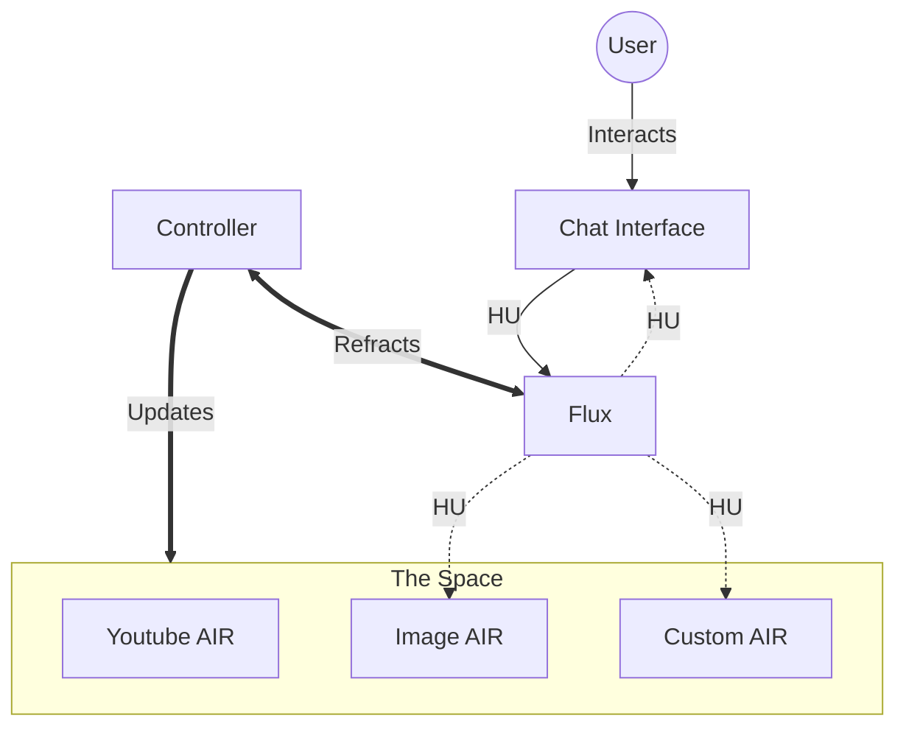

# 🏗️ Aura Architecture

For a high-level view of how Aura integrates with the Saga project and Atmosphere, see [[Integrating Aura]].

This document details the technical architecture of the Aura system, focusing on the interactions between the Registry, the Context (**"The Space"**), and the individual AIRs.

## System Diagram



## The Controller

**The Controller** (formerly Manager/Caster) is the intelligent core of Aura. Its mission is to:


1.  **Control the UI**: It holds the ultimate authority over "The Space." It decides what is rendered, where it is placed, and when it is removed.
2.  **Make Smart Decisions**: It listens to the **Flux** and "Casts" raw information into actions. If an HU contains a weather intent, the Controller decides to spawn a Weather AUR. It dynamically starts, ends, or modifies UI elements based on the data stream.

## The AIR Standard (v0.1) (`AIRManifest`)

Every valid component in the Aura system must adhere to the `AURManifest` interface. This ensures that the system can validate, manage, and "understand" the capabilities of every window.

```typescript
export interface AIRManifest {
    id: string; // Unique identifier (e.g., 'weather-aur')
    component: React.ComponentType<any>; // The React Component to render
    meta: {
        title: string; // Display name
        icon: string; // Emoji or Icon URL
        description: string; // For the 'Add Window' menu
    };
    instructions?: {
        system?: string; // System prompt for the AI agent
        tasks?: Record<string, string>; // Specific sub-tasks
    };
    logic?: Record<string, Function>; // Headless functions
}
```

## [[The Atmosphere]] (Registry)

The Atmosphere acts as the gatekeeper, validating and indexing all available AIRs.
*See full documentation: [[Atmosphere]]*

## Data Flow: [[Flux]]

Flux is the targeted, bidirectional signaling protocol connecting the Controller and AIRs.
*See full documentation: [[Flux]]*

## State Management

Window management (position, z-index, minimization) is handled by the `AURContext`. It maintains a list of `AURState` objects, completely separate from the `AURManifest`.

-   **Manifest**: *Static* definition (What the AIR is).
-   **State**: *Dynamic* instance (Where the AIR is right now).
