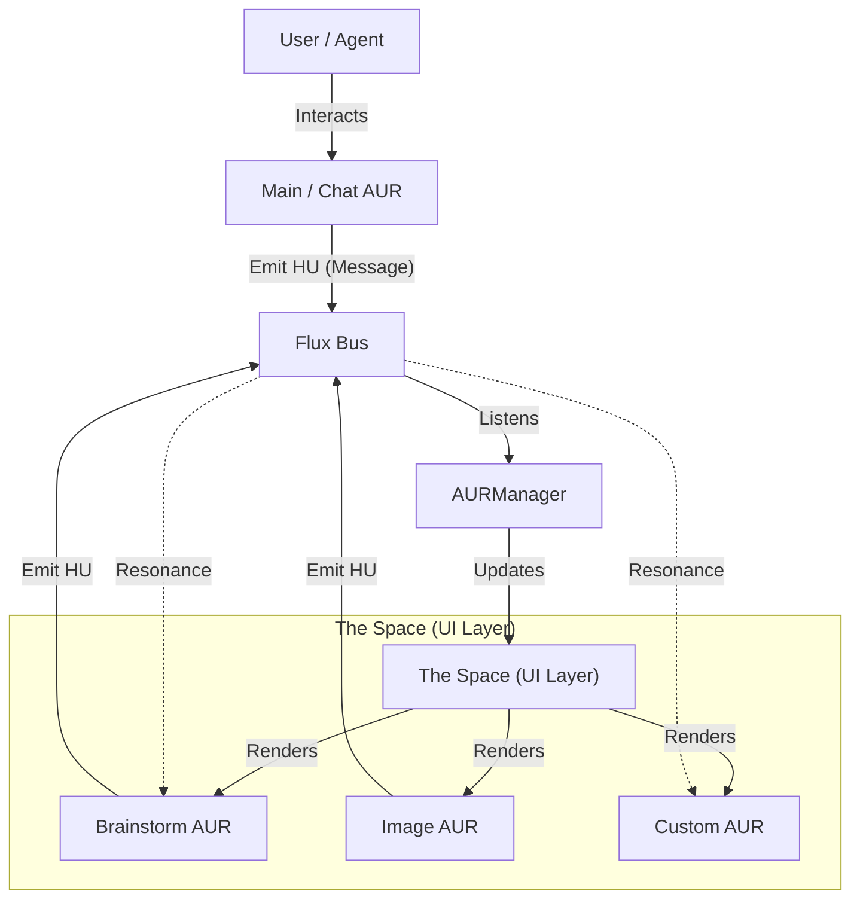

> **💿 Aura Documentation**
> [🏠 Home](../README.md) &nbsp; • &nbsp; [🏗️ Architecture](Architecture.md) &nbsp; • &nbsp; [👩‍💻 Developer Guide](Developer-Guide.md)

# 🏗️ Aura Architecture

This document details the technical architecture of the Aura system, focusing on the interactions between the Registry, the Context (**"The Space"** - *The Visual UI Layer*), and the individual AURs.

## System Diagram



## The New AUR Standard (`AURManifest`)

Every valid component in the Aura system must adhere to the `AURManifest` interface. This ensures that the system can validate, manage, and "understand" the capabilities of every window.

```typescript
export interface AURManifest {
    id: string; // Unique identifier (e.g., 'weather-aur')
    component: React.ComponentType<any>; // The React Component to render
    meta: {
        title: string; // Display name
        icon: string; // Emoji or Icon URL
        description: string; // For the 'Add Window' menu
    };
    instructions?: {
        system?: string; // System prompt for the AI agent
        tasks?: Record<string, string>; // Specific sub-tasks
    };
    logic?: Record<string, Function>; // Headless functions
}
```

## The Registry

The `auraRegistry` is a singleton service that acts as the gatekeeper for the system.

-   **Validation**: When `registry.register(manifest)` is called, it strictly validates that all required fields (id, component, meta) are present.
-   **Discovery**: It provides methods like `getAll()` and `getComponentMap()` for the `AURManager` to dynamically instantiate components.

## Data Flow: Flux & HUs

The communication system consists of two parts:
-   **Flux**: The active *Space* or bus that permeates the environment.
-   **HU (Holographic Update)**: The structured *message* payload traveling through the Flux.

For a detailed example of how these work together (including diagrams), see the [Developer Guide: Intelligent Orchestration](Developer-Guide.md#scenario-intelligent-orchestration).

1.  **Emission**: An AUR calls `broadcastSignal('HU', { type: 'INTENT', payload: ... })`.
2.  **Propagation**: The `AURContext` receives this HU and "pulses" it through the Flux.
3.  **Reception**: The `AURManager` (or other AURs) intercept the HU and react (e.g., by spawning new windows).
    ```

## State Management

Window management (position, z-index, minimization) is handled by the `AURContext`. It maintains a list of `AURState` objects, completely separate from the `AURManifest`.

-   **Manifest**: *Static* definition (What the AUR is).
-   **State**: *Dynamic* instance (Where the AUR is right now).
