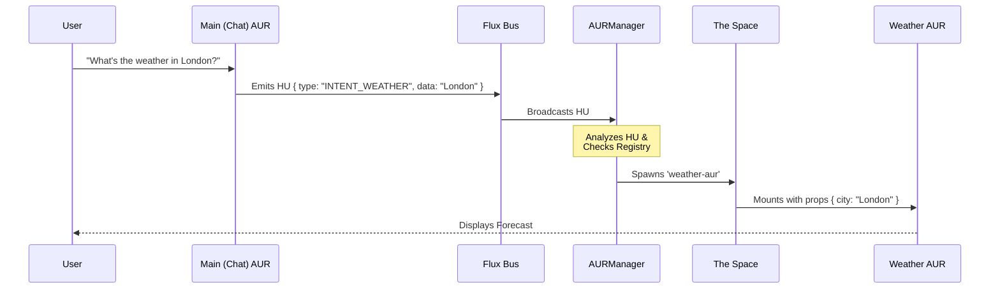

> **💿 Aura Documentation**
> [🏠 Home](../README.md) &nbsp; • &nbsp; [🏗️ Architecture](Architecture.md) &nbsp; • &nbsp; [👩‍💻 Developer Guide](Developer-Guide.md)

# 👩‍💻 Developer Guide: Creating AURs

This guide walks you through creating a new Agentic User Respondent (AUR) and registering it with the Aura system.

## The Anatomy of an AUR

A modern AUR is not just a React component; it is a **Manifest** containing UI, Identity, and Intelligence.

```typescript
// The Goal: To export this structure
const WeatherAURManifest: AURManifest = {
    id: 'weather-aur',
    component: WeatherView,
    meta: { ... },
    instructions: { ... }
};
```

## Scenario: Intelligent Orchestration

Let's walk through a real-world example: **The Weather Interaction**.
In this scenario, we want to show how a user's request propagates through Flux using HUs to spawn the correct AUR.



### The Flow
1.  **User Request**: User chats with the Main AUR: *"What's the weather in London?"*
2.  **HU Emission**: The Main AUR processes this and emits a Holographic Update (HU) to the Flux.
    ```typescript
    broadcastSignal('HU', {
        type: 'INTENT_DETECTED',
        payload: {
            intent: 'WEATHER_CHECK',
            entities: { location: 'London' }
        }
    });
    ```
3.  **Flux Propagation**: The Flux Bus carries this HU to the `AURManager`.
4.  **Manager Decision**: The `AURManager` analyzes the HU:
    -   *Intent*: `WEATHER_CHECK`
    -   *Registry Lookup*: Finds `weather-aur` matches this intent.
5.  **Spawning**: The Manager updates **The Space (UI)** to include the new window, passing `{ city: 'London' }` as props.
6.  **Response**: The new AUR appears instantly in the visual environment, displaying the forecast.

---

## Step 1: Create the Component

Create a standard React component. It receives data via props and interacts with the system via hooks.

**`src/components/aurs/WeatherAUR.tsx`**
```tsx
import React from 'react';
import styles from './AURs.module.css'; // Use shared styles!
import { useAURSignal } from '../../hooks/useAURSignal';

interface WeatherProps {
    city?: string;
}

export const WeatherView: React.FC<WeatherProps> = ({ city = "London" }) => {
    // Listen for Flux updates (e.g., if a user selects a city in another map AUR)
    useAURSignal((signal, data) => {
        if (signal === 'HU' && data.type === 'CITY_SELECTED') {
            console.log("New city selected via HU:", data.payload.city);
        }
    });

    return (
        <div className={styles.screenContent}>
            <div className={styles.aurSectionTitle}>Current Weather</div>
            <div className={styles.scrollArea}>
                <h1>{city}</h1>
                <p>24°C - Sunny</p>
            </div>
        </div>
    );
};
```

## Step 2: Define the Manifest

In the same file (or a separate one if you prefer), define the metadata and AI instructions.

```tsx
import { AURManifest } from '../../registry';

export const WeatherAUR: AURManifest = {
    id: 'weather',
    component: WeatherView,
    meta: {
        title: 'Weather Station',
        icon: '🌥️',
        description: 'Displays current weather and forecasts for selected locations.'
    },
    instructions: {
        system: "You are a meteorological assistant. When the user asks about weather, use the Logic tools to fetch data.",
        tasks: {
            "forecast": "Analyze the next 5 days of weather data and provide a summary."
        }
    }
};
```

## Step 3: Register the AUR

Finally, import your manifest in `registry.ts` and register it.

**`src/registry.ts`**
```typescript
import { WeatherAUR } from './components/aurs/WeatherAUR';

// ...
auraRegistry.register(WeatherAUR);
```

## Best Practices

1.  **Use `AURs.module.css`**: Do not create custom CSS files unless absolutely necessary. The shared module ensures visual consistency (padding, scrollbars, colors).
2.  **Stateless is Better**: Try to keep your AURs stateless. Rely on the `data` prop passed from the `AURManager` or signals from the `Flux` bus.
3.  **Unique IDs**: Choose a unique, descriptive ID (e.g., `youtube-player` instead of `video`).
4.  **Graceful Loading**: Always handle empty states or loading states (use the `.hourglass` class from generic styles).
