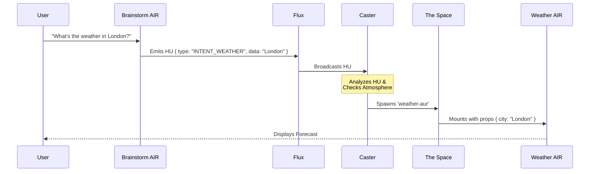

# 👩‍💻 Developer Guide: Creating AIRs

This guide walks you through creating a new Agentic Interactive Respondent (AIR) and registering it with the Aura system.

## The Anatomy of an AIR

A modern AIR is not just a React component; it is a **Manifest** containing UI, Identity, and Intelligence.

```typescript
// The Goal: To export this structure
const WeatherAIRManifest: AIRManifest = {
    id: 'weather-air',
    component: WeatherView,
    meta: { ... },
    instructions: { ... }
};
```

## Scenario: Intelligent Orchestration

Let's walk through a real-world example: **The Weather Interaction**.
In this scenario, we want to show how a user's request propagates through Flux using HUs to spawn the correct AUR.



### The Flow
1.  **User Request**: User chats with the Brainstorm AIR: *"What's the weather in London?"*
2.  **HU Emission**: The Brainstorm AIR processes this and emits a Holographic Update (HU) to the Flux.
    ```typescript
    flux.dispatch({
        to: 'caster', // Targeted to the System Core
        type: 'INTENT_DETECTED',
        payload: {
            intent: 'WEATHER_CHECK',
            entities: { location: 'London' }
        }
    });
    ```
3.  **Caster Decision**: The `Caster` (listening to Flux) analyzes the HU:
    -   *Intent*: `WEATHER_CHECK`
    -   *Atmosphere Lookup*: Finds `weather-air` matches this intent.
5.  **Spawning**: The Caster updates **The Space (UI)** to include the new window, passing `{ city: 'London' }` as props.
6.  **Response**: The new AIR appears instantly in the visual environment, displaying the forecast.

---

## Step 1: Create the Component

Create a standard React component. It receives data via props and interacts with the system via hooks.

**`src/components/aurs/WeatherAUR.tsx`**
```tsx
import React from 'react';
import styles from './AURs.module.css'; // Use shared styles!
import { useAURSignal } from '../../hooks/useAURSignal';

interface WeatherProps {
    city?: string;
}

export const WeatherView: React.FC<WeatherProps> = ({ city = "London" }) => {
    // Listen for Flux updates (e.g., if a user selects a city in another map AIR)
    useAURSignal((message) => {
        if (message.type === 'CITY_SELECTED') {
            console.log("New city selected via Flux:", message.payload.city);
        }
    });

    return (
        <div className={styles.screenContent}>
            <div className={styles.aurSectionTitle}>Current Weather</div>
            <div className={styles.scrollArea}>
                <h1>{city}</h1>
                <p>24°C - Sunny</p>
            </div>
        </div>
    );
};
```

## Step 2: Define the Manifest

In the same file (or a separate one if you prefer), define the metadata and AI instructions.

```tsx
import { AIRManifest } from '../../atmosphere';

export const WeatherAIR: AIRManifest = {
    id: 'weather-air',
    component: WeatherView,
    meta: {
        title: 'Weather Station',
        icon: '🌥️',
        description: 'Displays current weather and forecasts for selected locations.'
    },
    instructions: {
        system: "You are a meteorological assistant. When the user asks about weather, use the Logic tools to fetch data.",
        tasks: {
            "forecast": "Analyze the next 5 days of weather data and provide a summary."
        }
    }
};
```

## Step 3: Register the AIR

**`src/registry.ts`**
```typescript
import { atmosphere } from '../../atmosphere';
 
// ...
atmosphere.register(WeatherAIR);
```

## Best Practices

1.  **Use `AURs.module.css`**: Do not create custom CSS files unless absolutely necessary. The shared module ensures visual consistency (padding, scrollbars, colors).
2.  **Stateless is Better**: Try to keep your AIRs stateless. Rely on the `data` prop passed from the `Caster` or signals from the `Flux` bus.
3.  **Unique IDs**: Choose a unique, descriptive ID (e.g., `youtube-player` instead of `video`).
4.  **Graceful Loading**: Always handle empty states or loading states (use the `.hourglass` class from generic styles).
