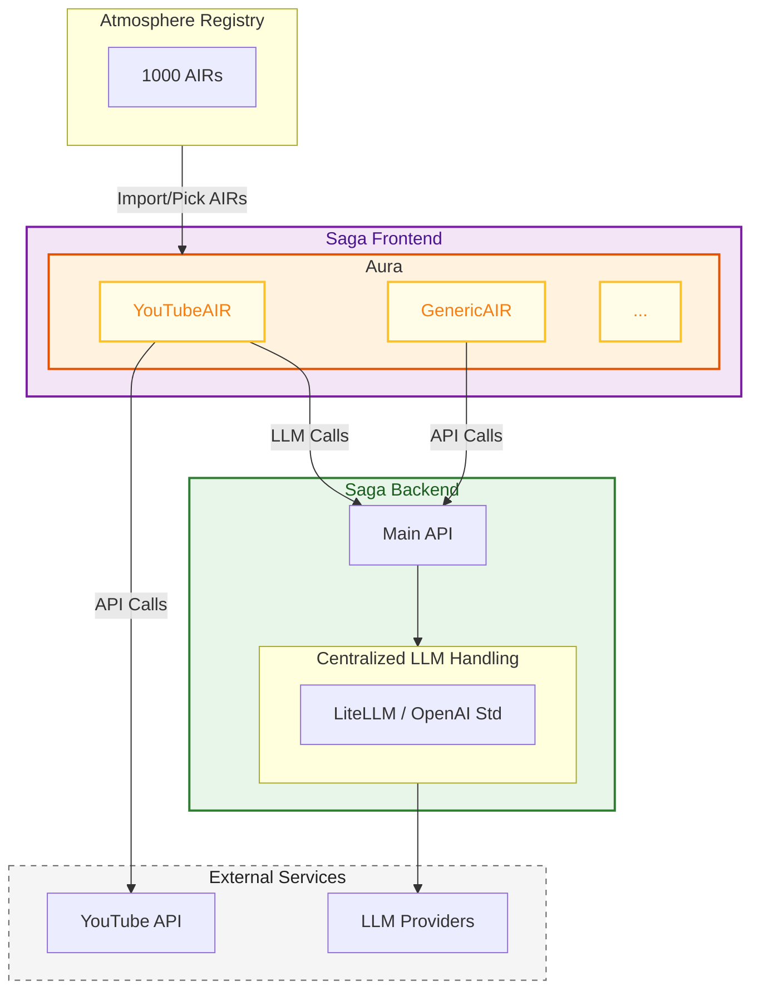

# Saga & Aura Integration Architecture

This document describes the high-level architecture connectivity between Saga, Aura, and the Atmosphere ecosystem.

## Vision Overview

The architecture consists of a few key components:
1.  **Atmosphere**: A vast cloud registry containing thousands of **AIRs**.
2.  **Saga Frontend**: The user's project environment which integrates **Aura**.
3.  **Aura**: The integration layer living inside the Saga frontend, responsible for managing AIRs.
4.  **Saga Backend**: The centralized backend service that handles heavy lifting, including a standardized LLM interface.

## Architecture Diagram

## Component Descriptions

### Atmosphere
Atmosphere acts as the global marketplace or registry. It hosts:
-   **AIRs**: Plug-and-play modules for Aura.
Developers pick and choose AIRs from Atmosphere to import into their local Saga project.

### Aura (in Saga Frontend)
Aura is the "kernel" or manager embedded within the Saga Frontend. It hosts the selected AIR instances (like `YouTubeAIR` or `GenericAIR`). It provides the runtime environment for these modules to exist and communicate.

### AIRs
Individual modules that run inside Aura.
-   **YouTubeAIR**: An example module that might talk directly to external APIs (like YouTube) or through the backend.
-   **GenericAIR**: Represents standard modules that communicate with the Saga Backend for business logic.

### Saga Backend
The separate backend service.
-   **Centralized LLM Handling**: To optimize performance and cost, all LLM interactions are routed through the backend.
-   **LiteLLM**: Used to standardize calls to the OpenAI format, abstracting away specific provider differences.
