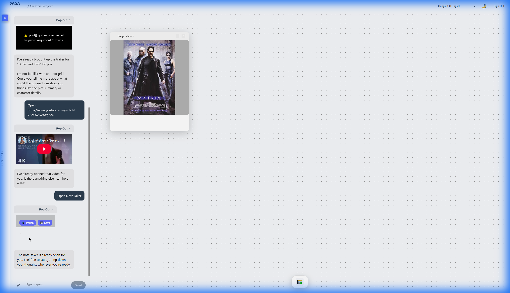

# Note Taker AIR

A smart note-taking companion for the Aura Space, featuring Gemini-powered text polishing and markdown export.

## Features

-   **Smart Formatting**: Automatically defaults to bullet points for structured thought.
-   **AI Polish**: "Polish" button uses Gemini Pro to refine your notes, fix grammar, and organize complex thoughts.
-   **Export**: Built-in logic to save notes as `.md` files directly to your device.
-   **Persistence**: Automatically saves your current notes (debounced) so they persist even if you close the window or reload the page.
-   **Theme Integration**: Fully responsive glassmorphism design that adapts to the Aura Space theme.

## Architecture

-   **Model**: Handles state `value`, formatting logic, and API calls to `/api/notes/polish`.
-   **View**: Uses standard `aur.module.css` for consistent styling.
-   **Backend**: Dedicated endpoint in Saga Backend for text processing.

## Usage

1.  Open the Note Taker AIR.
2.  Start typing (bullet points are encouraged).
3.  Click **Polish** to let Gemini refine your notes.
4.  Click **Save** to download a local copy.
