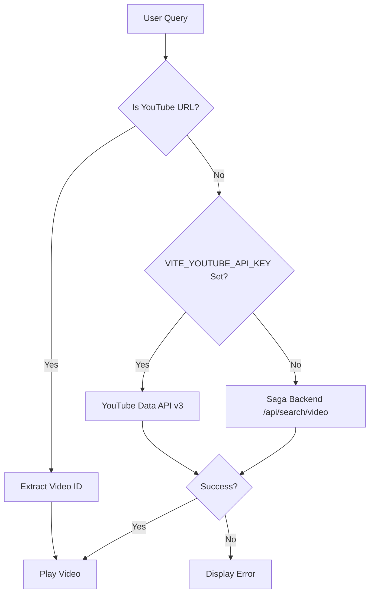

# YouTube Player AIR

A dedicated, isolated YouTube video player for the Aura interface with **client-side search** capabilities.


## Features
- **Client-Side YouTube Search**: Uses YouTube Data API v3 directly (requires `VITE_YOUTUBE_API_KEY`)
- **Backend Fallback**: Automatically falls back to Saga backend if API key is not configured
- **Direct URL Support**: Instantly plays videos from YouTube URLs (no API call needed)
- **Embedded Player**: Uses the official YouTube IFrame Player API
- **Isolated Credentials**: API key is scoped to Aura only

## Setup (Optional but Recommended)

### Get YouTube Data API Key
1. Go to [Google Cloud Console](https://console.cloud.google.com/)
2. Create a new project or select existing
3. Enable **YouTube Data API v3**
4. Go to **Credentials** → **Create Credentials** → **API Key**
5. (Optional) Restrict the key to YouTube Data API v3 and your domain

### Configure Aura
Add to your `.env` file in the Aura root:
```env
VITE_YOUTUBE_API_KEY=AIzaSy...your_key_here
```

**Without this key**: The system falls back to Saga backend search (current behavior).

**Free Quota**: Google provides 10,000 units/day free. Each search costs ~100 units = ~100 searches/day.

## Usage

### Direct Video ID
```typescript
<YoutubePlayerAIR videoId="dQw4w9WgXcQ" />
```

### Search Query (Client-side with API Key)
```typescript
<YoutubePlayerAIR query="Dune 2 Trailer" />
```

### Direct URL (No API Call)
```typescript
<YoutubePlayerAIR query="https://www.youtube.com/watch?v=dQw4w9WgXcQ" />
```

## Architecture

### Search Flow



**Flow Explanation:**
1. **URL Detection**: If query is a YouTube URL, extract video ID immediately (no API call)
2. **Client-Side Search**: If `VITE_YOUTUBE_API_KEY` is set, use YouTube Data API v3
3. **Backend Fallback**: If no API key, use Saga `/api/search/video` endpoint

### Console Logs
- `[YouTube AIR] Using YouTube Data API (client-side)` - Using official API
- `[YouTube AIR] Using Saga backend fallback` - No API key configured
- `[YouTube AIR] Extracted video ID from URL` - Direct URL detected
